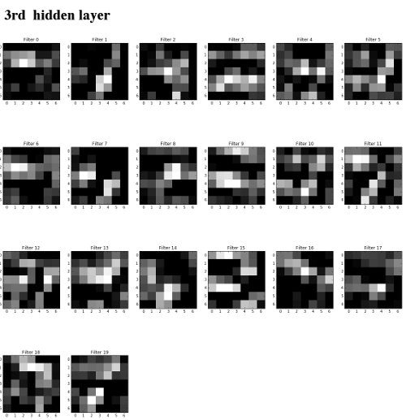

### Deep Neural Network Visualization

#### This is a toy example for visualization of deep neural network layer activation. The DNN trained on MNIST training data.

* MNIST database downloaded and fetched from the web

* A convolutional neural network trained on the entire database consist of
   three convolutional layer with kernel size: 5 followed by a max pool layer
   with kernel size: 2. The first and second convolutional layer performed 5
   times on it's input, the third one performed 20 times, followed by a fully
   connected layer in the end.
    * The loss function is cross entropy based, and
    finally the optimizer performed by Adam optimizer.

* A visualization test has been performed by selecting five test images
  from MNIST randomly and plotting the corresponding activation of every
  hidden layer.

>Note that the visualization module first show the test image, then the
activations of the layers. 5 second delay has been used between image
plotting.

#
#


### Dependencies
This code is dependent on TensorFlow and Matplotlib.
It has been tested on MacOs Sierra 10.12.3 with
- Python (2.7)
- Matplotlib (1.3.1)

### Install
- *MacOs:*

    Install TensorFlow, Matplotlib

    ## Open a terminal.

    Open `Terminal`. This instruction assumes you are using `bash`, which you
    probably are.

    ## Clone this repository

    Using git, clone this project and enter that directory.

    ```
    git clone https://github.com/attilaborcs/dnn-visualization.git
    cd dnn-visualization
    ```

    ## Install Pip, Virtualenv and Matplotlib

    Pip is a package management system used to install and manage software
    packages written in Python.  Virtualenv allows you to manage multiple
    package installations.

    At your Terminal window, run the following command.
    ```
    # Mac OS X
    sudo easy_install --upgrade pip
    ```

    Once you've installed pip, you'll need to add a few more packages.

    ```
    sudo easy_install --upgrade six
    sudo pip install --upgrade virtualenv
    sudo pip install matplotlib
    ```

    These should some dependencies and Virtualenv.

    Now, create a virtual environment.

    ```
    virtualenv --system-site-packages ~/tensorflow
    ```
    You will need to Activate the environment, which is to say switch your
    Python enviroment to a fresh one with clean dependencies.

    ```
    source ~/tensorflow/bin/activate
    ```

    You are now running in a special Python enviroment with safe
    dependencies. Your prompt should start with `(tensorflow) $`.

### Usage
You can try DNN visualization of mnist dataset located in the ./mnist/ folder by running:
```
cd dnn-visualization; python run.py
```
> * Code Styling: To format source files we use the YAPF tool with style settings set to "google". Each committed python source file should be formatted accordingly. To install YAPF run $ pip install yapf and use as yapf filename.py --style "google".

> * Note: Demonstration video can be found in ./doc folder  
### Contributors
Attila Börcs
